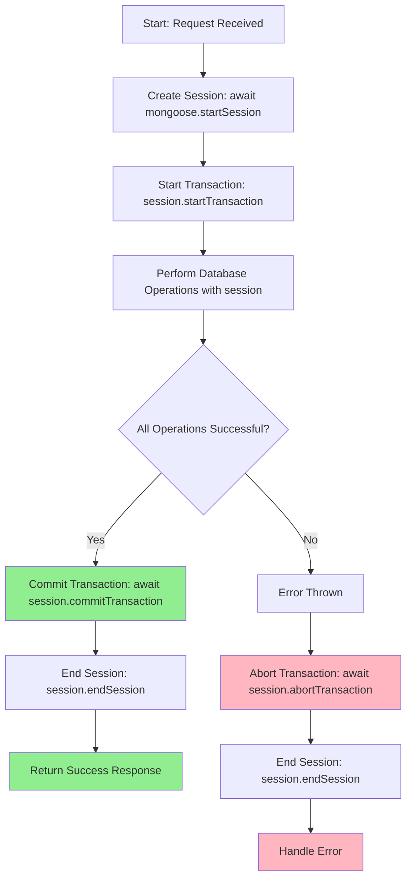
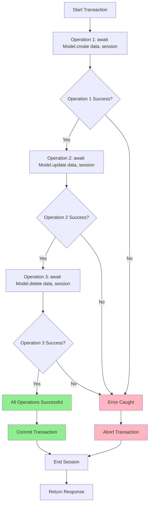
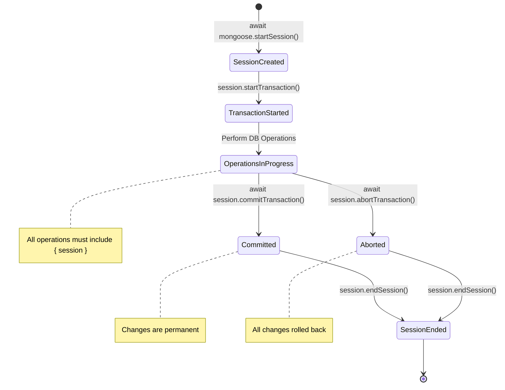
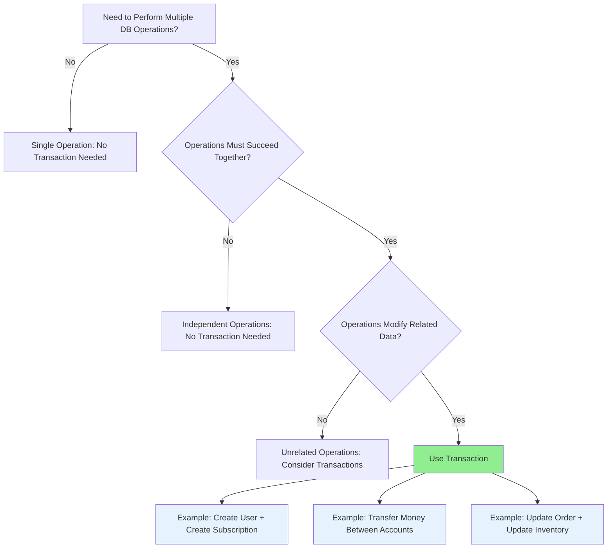

# MongoDB Transactions Guide

## Table of Contents

1. [Introduction](#introduction)
2. [What are Transactions?](#what-are-transactions)
3. [Transaction Methods](#transaction-methods)
4. [Complete Transaction Flow](#complete-transaction-flow)
5. [Flow Diagrams](#flow-diagrams)
6. [Code Examples](#code-examples)
7. [Best Practices](#best-practices)
8. [Common Pitfalls](#common-pitfalls)
9. [Error Handling Patterns](#error-handling-patterns)

---

## Introduction

MongoDB transactions allow you to execute multiple database operations as a single atomic unit. This means either **all operations succeed** or **all operations fail** together, ensuring data consistency and integrity.

### Why Use Transactions?

- **Atomicity**: All operations succeed or fail together
- **Consistency**: Database remains in a valid state
- **Isolation**: Concurrent transactions don't interfere with each other
- **Durability**: Committed changes are permanent

---

## What are Transactions?

A transaction in MongoDB is a sequence of database operations that:

- Starts with `startTransaction()`
- Contains one or more database operations
- Ends with either `commitTransaction()` (success) or `abortTransaction()` (failure)

### Key Concepts

1. **Session**: A logical connection to MongoDB that tracks operations
2. **Transaction**: A set of operations executed within a session
3. **Commit**: Makes all changes permanent
4. **Abort**: Rolls back all changes

---

## Transaction Methods

### 1. `startSession()`

Creates a new MongoDB session. This is **asynchronous** and returns a Promise.

```javascript
const session = await mongoose.startSession();
```

**Important**: This method requires `await` because it communicates with the database to create a session.

### 2. `startTransaction()`

Starts a transaction on the session. This is **synchronous** and does NOT return a Promise.

```javascript
session.startTransaction();
```

**Why no await?**

- `startTransaction()` is synchronous - it only sets up a transaction context in memory
- No database round-trip is needed at this point
- It doesn't return a Promise, so `await` is not needed

### 3. `commitTransaction()`

Commits the transaction, making all changes permanent. This is **asynchronous** and returns a Promise.

```javascript
await session.commitTransaction();
```

**Important**: This method requires `await` because it communicates with the database to finalize the transaction.

### 4. `abortTransaction()`

Aborts the transaction, rolling back all changes. This is **asynchronous** and returns a Promise.

```javascript
await session.abortTransaction();
```

**Important**: This method requires `await` because it communicates with the database to roll back the transaction.

### 5. `endSession()`

Ends the session and releases resources. This is **synchronous** and does NOT return a Promise.

```javascript
session.endSession();
```

**Why no await?**

- `endSession()` is synchronous - it marks the session for cleanup
- No database round-trip is needed
- It doesn't return a Promise, so `await` is not needed

---

## Complete Transaction Flow

### Basic Structure

```javascript
const session = await mongoose.startSession();
session.startTransaction();

try {
  // Perform database operations with { session }
  await Model.operation(data, { session });

  // If everything succeeds, commit
  await session.commitTransaction();
  session.endSession();

  // Return success response
} catch (error) {
  // If anything fails, abort
  await session.abortTransaction();
  session.endSession();

  // Handle error
}
```

### Critical Rules

1. ✅ **Always** pass `{ session }` to database operations
2. ✅ **Always** commit or abort before ending session
3. ✅ **Always** end the session (even on error)
4. ✅ **Always** use try-catch for error handling

---

## Flow Diagrams

### Transaction Success Flow



### Transaction Error Flow



### Session Lifecycle



### Decision Tree: When to Use Transactions



---

## Code Examples

### Example 1: Basic Transaction Pattern

```javascript
import mongoose from "mongoose";
import User from "./models/user.model.js";

export const createUserWithTransaction = async (req, res, next) => {
  const session = await mongoose.startSession();
  session.startTransaction();

  try {
    const { name, email, password } = req.body;

    // Check if user exists (without session - read operation)
    const existingUser = await User.findOne({ email });
    if (existingUser) {
      throw new Error("User already exists");
    }

    // Create user (with session - write operation in transaction)
    const users = await User.create([{ name, email, password }], { session });

    // Commit transaction
    await session.commitTransaction();
    session.endSession();

    res.status(201).json({
      success: true,
      message: "User created successfully",
      data: { user: users[0] },
    });
  } catch (error) {
    // Abort transaction on error
    await session.abortTransaction();
    session.endSession();
    next(error);
  }
};
```

### Example 2: Multi-Operation Transaction

```javascript
import mongoose from "mongoose";
import User from "./models/user.model.js";
import Subscription from "./models/subscription.model.js";

export const createUserWithSubscription = async (req, res, next) => {
  const session = await mongoose.startSession();
  session.startTransaction();

  try {
    const { name, email, password, planName, price } = req.body;

    // Operation 1: Create user
    const users = await User.create([{ name, email, password }], { session });
    const userId = users[0]._id;

    // Operation 2: Create subscription
    const subscriptions = await Subscription.create(
      [{ userId, planName, price }],
      { session }
    );

    // Operation 3: Update user with subscription reference
    await User.findByIdAndUpdate(
      userId,
      { subscriptionId: subscriptions[0]._id },
      { session }
    );

    // If all operations succeed, commit
    await session.commitTransaction();
    session.endSession();

    res.status(201).json({
      success: true,
      message: "User and subscription created successfully",
      data: {
        user: users[0],
        subscription: subscriptions[0],
      },
    });
  } catch (error) {
    // If any operation fails, abort all changes
    await session.abortTransaction();
    session.endSession();
    next(error);
  }
};
```

### Example 3: Transaction with Validation

```javascript
export const transferSubscription = async (req, res, next) => {
  const session = await mongoose.startSession();
  session.startTransaction();

  try {
    const { fromUserId, toUserId, subscriptionId } = req.body;

    // Validate users exist
    const fromUser = await User.findById(fromUserId);
    const toUser = await User.findById(toUserId);

    if (!fromUser || !toUser) {
      throw new Error("One or both users not found");
    }

    // Operation 1: Remove subscription from source user
    await User.findByIdAndUpdate(
      fromUserId,
      { $unset: { subscriptionId: "" } },
      { session }
    );

    // Operation 2: Add subscription to target user
    await User.findByIdAndUpdate(toUserId, { subscriptionId }, { session });

    // Operation 3: Update subscription owner
    await Subscription.findByIdAndUpdate(
      subscriptionId,
      { userId: toUserId },
      { session }
    );

    await session.commitTransaction();
    session.endSession();

    res.json({
      success: true,
      message: "Subscription transferred successfully",
    });
  } catch (error) {
    await session.abortTransaction();
    session.endSession();
    next(error);
  }
};
```

---

## Best Practices

### 1. Always Use Try-Catch

```javascript
// ✅ Good
try {
  await session.commitTransaction();
} catch (error) {
  await session.abortTransaction();
}

// ❌ Bad - No error handling
await session.commitTransaction();
```

### 2. Always End Session

```javascript
// ✅ Good
try {
  await session.commitTransaction();
  session.endSession();
} catch (error) {
  await session.abortTransaction();
  session.endSession();
}

// ❌ Bad - Session leak
await session.commitTransaction();
// Missing endSession()
```

### 3. Pass Session to All Operations

```javascript
// ✅ Good
await User.create([data], { session });
await User.findByIdAndUpdate(id, update, { session });

// ❌ Bad - Operations not in transaction
await User.create([data]); // Missing { session }
await User.findByIdAndUpdate(id, update); // Missing { session }
```

### 4. Commit or Abort Before Ending Session

```javascript
// ✅ Good
await session.commitTransaction();
session.endSession();

// ❌ Bad - Ending session without commit/abort
session.endSession(); // Transaction still active!
```

### 5. Handle Errors Properly

```javascript
// ✅ Good
catch (error) {
    await session.abortTransaction();
    session.endSession();
    next(error); // Pass to error handler
}

// ❌ Bad - Swallowing errors
catch (error) {
    // Error ignored, transaction might be stuck
}
```

---

## Common Pitfalls

### Pitfall 1: Forgetting to Pass Session

```javascript
// ❌ Wrong
const session = await mongoose.startSession();
session.startTransaction();
const user = await User.create({ name, email }); // Missing { session }
await session.commitTransaction();

// ✅ Correct
const session = await mongoose.startSession();
session.startTransaction();
const user = await User.create([{ name, email }], { session });
await session.commitTransaction();
```

### Pitfall 2: Not Awaiting Async Methods

```javascript
// ❌ Wrong
session.abortTransaction(); // Missing await
session.endSession();

// ✅ Correct
await session.abortTransaction();
session.endSession();
```

### Pitfall 3: Ending Session Without Commit/Abort

```javascript
// ❌ Wrong
session.startTransaction();
await User.create([data], { session });
session.endSession(); // Transaction never committed!

// ✅ Correct
session.startTransaction();
await User.create([data], { session });
await session.commitTransaction();
session.endSession();
```

### Pitfall 4: Not Handling Errors

```javascript
// ❌ Wrong
const session = await mongoose.startSession();
session.startTransaction();
await User.create([data], { session });
await session.commitTransaction();
session.endSession();
// What if create() throws an error?

// ✅ Correct
const session = await mongoose.startSession();
session.startTransaction();
try {
  await User.create([data], { session });
  await session.commitTransaction();
  session.endSession();
} catch (error) {
  await session.abortTransaction();
  session.endSession();
  throw error;
}
```

### Pitfall 5: Read Operations in Transaction

```javascript
// ⚠️ Consider: Do you need reads in transaction?
// Read operations don't need { session } unless you need read consistency

// ✅ Optional: Read with session for consistency
const user = await User.findOne({ email }, { session });

// ✅ Also valid: Read without session (if consistency not critical)
const user = await User.findOne({ email });
```

---

## Error Handling Patterns

### Pattern 1: Standard Try-Catch

```javascript
const session = await mongoose.startSession();
session.startTransaction();

try {
  // Operations
  await session.commitTransaction();
  session.endSession();
  // Success response
} catch (error) {
  await session.abortTransaction();
  session.endSession();
  // Error handling
}
```

### Pattern 2: Early Return Pattern

```javascript
const session = await mongoose.startSession();
session.startTransaction();

try {
  // Validation
  if (someCondition) {
    await session.abortTransaction();
    session.endSession();
    return res.status(400).json({ error: "Invalid data" });
  }

  // Operations
  await session.commitTransaction();
  session.endSession();
  // Success response
} catch (error) {
  await session.abortTransaction();
  session.endSession();
  next(error);
}
```

### Pattern 3: Nested Transactions (Advanced)

```javascript
// Note: MongoDB doesn't support nested transactions
// But you can use multiple sessions for complex scenarios

const outerSession = await mongoose.startSession();
outerSession.startTransaction();

try {
  // Outer transaction operations

  const innerSession = await mongoose.startSession();
  innerSession.startTransaction();

  try {
    // Inner transaction operations
    await innerSession.commitTransaction();
  } catch (error) {
    await innerSession.abortTransaction();
    throw error;
  } finally {
    innerSession.endSession();
  }

  await outerSession.commitTransaction();
} catch (error) {
  await outerSession.abortTransaction();
} finally {
  outerSession.endSession();
}
```

---

## Summary

### Quick Reference

| Method                        | Async? | Requires Await? | Purpose           |
| ----------------------------- | ------ | --------------- | ----------------- |
| `mongoose.startSession()`     | ✅ Yes | ✅ Yes          | Create session    |
| `session.startTransaction()`  | ❌ No  | ❌ No           | Start transaction |
| `session.commitTransaction()` | ✅ Yes | ✅ Yes          | Commit changes    |
| `session.abortTransaction()`  | ✅ Yes | ✅ Yes          | Rollback changes  |
| `session.endSession()`        | ❌ No  | ❌ No           | Cleanup session   |

### Essential Checklist

- [ ] Create session with `await mongoose.startSession()`
- [ ] Start transaction with `session.startTransaction()`
- [ ] Pass `{ session }` to all write operations
- [ ] Use try-catch for error handling
- [ ] Commit with `await session.commitTransaction()` on success
- [ ] Abort with `await session.abortTransaction()` on error
- [ ] End session with `session.endSession()` in both cases

### Remember

> **Transactions ensure atomicity**: All operations succeed together, or all fail together. This is crucial for maintaining data consistency in your application.

---

## Additional Resources

- [MongoDB Transactions Documentation](https://www.mongodb.com/docs/manual/core/transactions/)
- [Mongoose Transactions Guide](https://mongoosejs.com/docs/transactions.html)
- [ACID Properties Explained](https://en.wikipedia.org/wiki/ACID)

---

_Last Updated: Based on MongoDB 6.0+ and Mongoose 7.0+_
